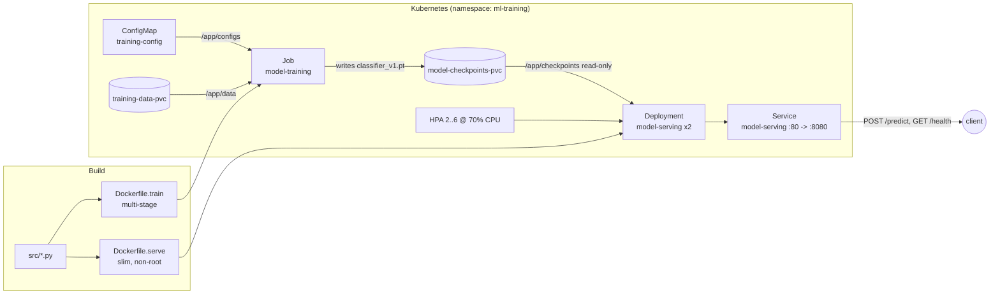

# mlops-pytorch-pipeline

A CIFAR-10 image classifier taken through the full deployment lifecycle: local
training, containerized training and serving with Docker, and orchestrated
deployment on Kubernetes (training `Job` + serving `Deployment`).

## Architecture



The three stages never share a process — they hand off through **mounted
volumes**. Training writes `classifier_v1.pt` to a PVC; serving mounts that PVC
read-only and loads the checkpoint at startup. Hyperparameters live in one YAML
file that is a bind mount locally and a `ConfigMap` in the cluster.

| Component | File | Notes |
|---|---|---|
| Model | [src/model.py](src/model.py) | `get_model("resnet18"\|"simplecnn", num_classes)`. ResNet-18 stem adapted for 32x32. |
| Data | [src/dataset.py](src/dataset.py) | `torchvision` CIFAR-10 (or Fashion-MNIST), transforms + `DataLoader`s. |
| Training | [src/train.py](src/train.py) | Config-driven loop, JSON-lines metrics to stdout, early stopping, best-checkpoint save. |
| Serving | [src/serve.py](src/serve.py) | FastAPI. `POST /predict` (multipart `image`), `GET /health`. Port 8080. |

### Config resolution

`train.py` and `serve.py` look for the config in this order:
`$TRAINING_CONFIG_PATH` → `/app/configs/training_config.yaml` → `configs/training_config.yaml`.
That single rule is what lets the same image run under `docker run` (bind mount)
and as a k8s pod (ConfigMap volume).

### Training output contract

`train.py` writes **only JSON to stdout** — one object per epoch
(`epoch`, `train_loss`, `train_accuracy`, `val_loss`, `val_accuracy`) plus event
objects (`checkpoint_saved`, `early_stopping`, `training_complete`). Set
`FAST_DEV_RUN=1` for a one-epoch / few-batch pass (used by CI and Docker checks).

## Quick start (local)

```bash
python -m venv .venv && source .venv/bin/activate
pip install -r requirements/dev.txt --extra-index-url https://download.pytorch.org/whl/cpu

make lint test          # ruff + pytest
make train              # trains, writes ./checkpoints/classifier_v1.pt
make serve              # FastAPI on http://localhost:8080

curl localhost:8080/health
curl -X POST localhost:8080/predict -F "image=@test_image.png"
```

## Docker

```bash
docker build -f docker/Dockerfile.train -t mlops-train:v1 .
docker run --rm \
  -v $(pwd)/data:/app/data \
  -v $(pwd)/checkpoints:/app/checkpoints \
  mlops-train:v1

docker build -f docker/Dockerfile.serve -t mlops-serve:v1 .
docker run --rm -p 8080:8080 -v $(pwd)/checkpoints:/app/checkpoints mlops-serve:v1
curl -X POST http://localhost:8080/predict -F "image=@test_image.png"
```

`./scripts/smoke_test.sh` (or `make smoke`) runs that whole round-trip with a
fast training pass.

- `Dockerfile.train`: multi-stage (deps venv → clean runtime), `PYTHONUNBUFFERED=1`.
- `Dockerfile.serve`: slim base, inference deps only (no `tensorboard`), non-root
  `appuser` (uid 1000), `EXPOSE 8080`, `HEALTHCHECK` on `/health`.

## Kubernetes

Load the images into your cluster first (they are never pushed to a registry):

```bash
minikube image load mlops-train:v1 mlops-serve:v1
# or:  kind load docker-image mlops-train:v1 && kind load docker-image mlops-serve:v1
```

```bash
kubectl apply -f k8s/namespace.yaml
kubectl apply -f k8s/configmap.yaml -f k8s/pvc.yaml
kubectl apply -f k8s/training-job.yaml
kubectl wait --for=condition=complete job/model-training -n ml-training --timeout=30m

kubectl apply -f k8s/serving-deployment.yaml -f k8s/serving-service.yaml -f k8s/hpa.yaml
kubectl get pods -n ml-training
kubectl describe deployment model-serving -n ml-training

kubectl port-forward svc/model-serving 8080:80 -n ml-training
curl -X POST http://localhost:8080/predict -F "image=@test_image.png"
```

| Manifest | What it sets |
|---|---|
| `namespace.yaml` | `ml-training` namespace |
| `configmap.yaml` | `training-config` — the YAML mounted at `/app/configs` |
| `pvc.yaml` | `training-data-pvc` (5Gi), `model-checkpoints-pvc` (1Gi) |
| `training-job.yaml` | Job; ConfigMap + PVCs mounted; requests/limits CPU 2 / Mem 4Gi; GPU block commented |
| `serving-deployment.yaml` | 2 replicas; checkpoint PVC read-only; liveness `/health` 10s (×3), readiness `/health` 5s (delay 15s); req 500m/1Gi, lim 1/2Gi; rolling update `maxSurge 1 / maxUnavailable 0` |
| `serving-service.yaml` | ClusterIP, `80 → 8080` |
| `hpa.yaml` | 2–6 replicas at 70% CPU (needs metrics-server) |

**Multi-node note:** the checkpoint PVC is `ReadWriteOnce`; with replicas on
different nodes switch it to `ReadWriteMany` (NFS / cloud filestore) or bake the
checkpoint into the serving image.

## Git workflow

See [docs/git-workflow.md](docs/git-workflow.md) for the branch layout and the
ready-to-paste PR descriptions. Summary: `main` ← `develop` ← `feature/*`, every
merge via PR, Conventional Commits.
